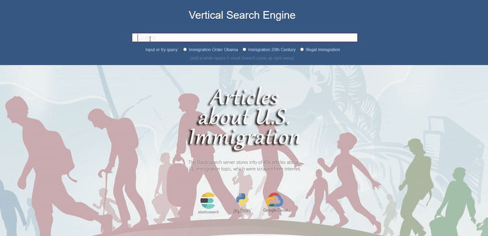

Vertical Search Engine (WUI)
=========
The code in this repository is the webpage user interface for a Vertical Search Engine. <br>
A Vertical Search Engine contain the information about a specific topic. The one I did <br>
is about the immigration history of United States. 
When user input a query, the application will return the most related result (webpages).<br>
A list of top 50 result will display on the right pane sorted by matching scores.<br>
The preview of the first result webpage will be rendered on the left pane.<br>

Link of live demo page can be found at: <br>
https://rexxwei.github.io/portfolio/


Rrerequisites
----
To use this interface, there are some setps need to be done beforehand.<br>
This repository doesn't include code for those purpose.

  - Data Collection (eg. collecting 40,000 webpages)
  - Database (Elasticsearch is better for this project)


Techniques
----
Below skills will contribute to accomplish your own deployment of the project.
  - Data Collecting (like WebScraping or working with API)
  - Text Processing (NLP)
  - Database Server (eg. Elasticsearch)
  - JavaScript, CSS, html <br>

The project can be deployed locally. <br>
If you want to deploy online, you might also need knowledge about:
  - Cloud Platform (AWS/GCP/Azure)
  - Backend Server (like Appache, Flask or dJango)


How to Use the Project
----
If you have a Elasticsearch server (local or on the cloud), you can download the repository and change 'url' and 'index_name' setting of 'config.js' (in 'js' folder).<br>
Change the ip and index name to your server hosting Elasticsearch instance.
```css
url: "your Elasticsearch server address",
index_name: "your index name",
```
After the config is set up, open 'index.html' in browser. <br>
The project should work well now.


Demo
=========

